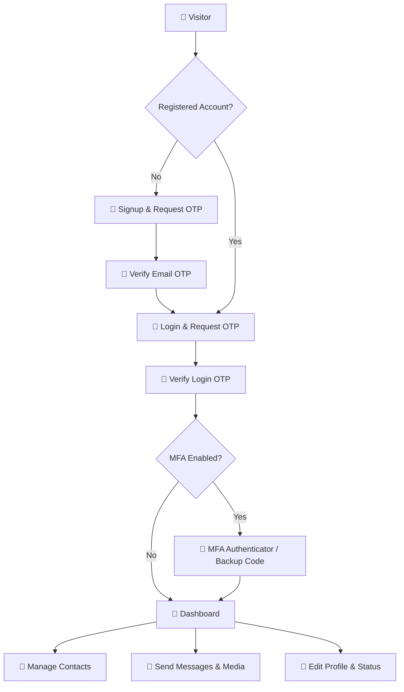
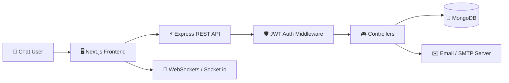

# 💬 QuickChat — Full-Stack Real-Time Chat Platform

<p align="center">
  
  
  
  
  
</p>

> A modern, secure and responsive web platform for **QuickChat**, built to facilitate real-time chat communication, contact management, profile customisation, and secure OTP and MFA authentication workflows.

---

## ✨ Overview

**QuickChat** is a full-stack real-time messaging application designed to provide users with a secure and responsive communication platform.

Customers can:

- Create and register a secure account verified by One-Time Password (OTP)
- Log in securely using multi-factor credentials
- Enable and use Authenticator App-based MFA (TOTP)
- Retrieve and use MFA backup recovery codes
- Update and customize their user profile, status message, and avatar
- Add, edit, and delete contacts to build a personalized contact directory
- Exchange real-time text and media messages with sent, delivered, and read receipt tracking
- Check the real-time online or offline status of their contacts
- Access the platform seamlessly across desktop, tablet, and mobile devices

The application follows a modular architecture with a **Next.js frontend**, **Node.js + Express REST API**, and a **MongoDB/Mongoose database** connected in real time via **Socket.io**.

---

## 🚀 Key Features

- 🏠 Dynamic dashboard and chat portal interface
- 👥 Custom contact directory (Add, edit, and delete contacts)
- 💬 Real-time chat messaging using WebSockets
- 📝 Secure registration and login flows
- 📧 Secure Email OTP-based verification
- 🔐 Multi-factor authentication (MFA) via TOTP Authenticator Apps
- 🛡️ Hashed MFA recovery/backup codes
- 🖼️ User profile customization with status messages and base64 avatar uploads
- ✔️ Live message status receipts (Sent, Delivered, Read status)
- 🟢 Real-time online/offline user status indicators
- 📂 Rich media sharing (base64 images/attachments support)
- 🔒 Secure authentication session using JWT tokens
- 🎨 Modern Tailwind CSS powered dark-mode/slate responsive UI
- 📱 Fully responsive layout across all device viewports

---

# 🛡️ Security Highlights

### 🔐 Authentication

```text
Signup
  ↓
OTP Verification (via email)
  ↓
Login
  ↓
MFA (if enabled, TOTP / Backup Code)
  ↓
Authenticated Session (JWT Token)
  ↓
Dashboard / Protected Features
```

### ✉️ Email OTP Verification

One-time verification passwords are generated securely, stored in the database with a 5-minute expiration time, and deleted immediately after successful validation to prevent replay attacks.

### 🔑 Password Security

Passwords are hashed using **bcryptjs** before being securely stored in MongoDB.

### 🛡️ MFA

Supports:
- Authenticator-based MFA (TOTP)
- Interactive MFA setup with automatically generated QR codes
- Secure login verification with option for backup codes
- Secure MFA disabling requiring password and code validation
- Automated generation of 6 hashed backup recovery codes upon activation

### 🎟️ JWT & Protected APIs

Private endpoints use standard JSON Web Tokens passed via Authorization headers and verified by the auth middleware:

```js
router.get('/auth/profile', requireAuth, getProfile);
```

Sensitive values such as password hashes, MFA secrets, and temporary secrets are strictly filtered out of API responses.

---

# 🔄 Application Workflow



---

# 🏗️ Architecture



---

# 🧰 Technology Stack

| Layer | Technologies |
|---|---|
| Frontend | Next.js 15, React 19, Socket.io-client, Axios |
| Styling | Tailwind CSS v4, PostCSS, Lucide Icons |
| Backend | Node.js, Express.js (v5) |
| Real-time Protocol | WebSockets via Socket.io |
| Database | MongoDB, Mongoose |
| Authentication | JWT (jsonwebtoken), OTP Verification |
| MFA Security | otplib (TOTP), qrcode (QR Code Generation) |
| Password Hashing | bcryptjs |
| Email Delivery | Nodemailer (SMTP Service) |
| API | REST API + WebSocket Events |

---

# 📁 Project Structure

```text
RealTimeChatApp/
│
├── Frontend/
│   ├── src/
│   │   ├── app/           # Next.js App Router (chat, contacts, login)
│   │   ├── assets/        # Client static assets
│   │   └── components/    # Reusable UI components & Layouts
│   ├── public/            # Public assets
│   ├── package.json       # Frontend dependencies & scripts
│   └── next.config.js     # Next.js environment configuration
│
├── Backend/
│   ├── src/
│   │   ├── config/        # Server configuration
│   │   ├── controllers/   # Controllers (auth, contact, message, user)
│   │   ├── middleware/    # Auth and error middleware
│   │   ├── models/        # Mongoose Schemas (User, Message, Contact, Otp)
│   │   ├── routes/        # Express API endpoints
   │   │   ├── services/      # Email service (Nodemailer)
   │   │   ├── socket/        # Socket.io connection & event handlers
   │   │   ├── app.js         # Express app bootstrap
   │   │   └── server.js      # Main entry point (HTTP + Socket.io + MongoDB)
   │   ├── public/uploads/    # Saved user profile pictures & shared media files
   │   └── package.json       # Backend dependencies & scripts
   │
   └── README.md              # Main project documentation
```

---

# 📡 Important API Endpoints

| Method | Endpoint | Access | Description |
|---|---|---|---|
| POST | `/api/auth/signup/send-otp` | Public | Send signup verification OTP to email |
| POST | `/api/auth/signup` | Public | Register user using received email OTP |
| POST | `/api/auth/login/send-otp` | Public | Verify password and send login OTP to email |
| POST | `/api/auth/login` | Public | Log in user with OTP (returns JWT or temp MFA token) |
| POST | `/api/auth/mfa/verify-login` | Public (Temp Token) | Verify MFA TOTP/backup code to retrieve full JWT token |
| GET | `/api/auth/profile` | Protected | Fetch current user's profile information |
| PUT | `/api/auth/profile` | Protected | Update profile (avatar, status, email, mobile, password) |
| POST | `/api/auth/mfa/setup` | Protected | Initiate MFA setup, returns secret & QR code URL |
| POST | `/api/auth/mfa/enable` | Protected | Confirm TOTP and generate 6 backup codes |
| POST | `/api/auth/mfa/disable` | Protected | Disable MFA using password and TOTP/backup code |
| GET | `/api/users` | Protected | Fetch registered user list |
| GET | `/api/contacts` | Protected | Get contact list of the current user |
| POST | `/api/contacts` | Protected | Add a new contact by username/mobile |
| PATCH | `/api/contacts/:contactId` | Protected | Update contact name/nickname |
| DELETE | `/api/contacts/:contactId` | Protected | Remove contact from list |
| GET | `/api/messages/:userId` | Protected | Retrieve message history with a specific user |
| POST | `/api/messages` | Protected | Save/send a new message |
| POST | `/api/messages/upload` | Protected | Upload media files/attachments |
| PATCH | `/api/messages/:messageId` | Protected | Update message status or text |
| DELETE | `/api/messages/:messageId` | Protected | Delete/unsend message |

---

# 🔌 Real-Time WebSocket Events (Socket.io)

### Client to Server (Emits)
- `send_message`: Sends message payload containing `receiverId`, `receiverMobile`, `text`, `mediaUrl`, etc.
- `read_messages`: Marks incoming unread messages from a contact as read.

### Server to Client (Listens)
- `receive_message`: Delivers incoming messages to the recipient in real time.
- `message_updated`: Updates modified message content or details in the UI.
- `message_deleted`: Notifies recipient that a message has been unsent/deleted.
- `messages_delivered`: Status receipt updating message delivery status.
- `messages_read`: Status receipt updating read receipt status.
- `user_online`: Notifies clients that a user has connected.
- `user_offline`: Notifies clients that a user has disconnected.

---

# ⚙️ Getting Started

## Prerequisites

- Node.js (v18+)
- npm
- MongoDB connection string (Atlas or local)
- SMTP Server/Credentials (e.g. Gmail App Password)

### 1. Clone the Repository

```bash
git clone <YOUR_GITHUB_REPOSITORY_URL>
cd RealTimeChatApp
```

### 2. Backend Setup

```bash
cd Backend
npm install
```

Create a `Backend/.env` file:

```env
PORT=5001
MONGODB_URI=your_mongodb_connection_string
CLIENT_ORIGIN=http://localhost:3000

# SMTP Configurations for Email OTP
SMTP_HOST=smtp.gmail.com
SMTP_PORT=587
SMTP_USER=your_email@example.com
SMTP_PASS=your_gmail_app_password
SMTP_FROM="QuickChat Security Email" your_email@example.com
```

### 3. Frontend Setup

```bash
cd ../Frontend
npm install
```

Create a `Frontend/.env` file:

```env
VITE_API_URL=http://localhost:5001
VITE_SOCKET_URL=http://localhost:5001
```

### 4. Run the Backend Server

```bash
cd ../Backend
npm run dev
```

### 5. Run the Frontend App

```bash
cd ../Frontend
npm run dev
```

Open your browser and navigate to:

```text
http://localhost:3000
```

---

# 🧪 Testing Flow

```text
Register Profile (Username, Email, Mobile, Password)
 ↓
Verify via Email OTP
 ↓
Login (Username/Mobile + Password)
 ↓
Verify via Login OTP
 ↓
Dashboard (Initialize Socket.io Connection)
 ↓
Manage Contacts (Add/Edit/Delete Contacts)
 ↓
Start Chatting (Text & Media Messages, Real-Time Online/Offline status)
 ↓
Message Receipts (Sent → Delivered → Read)
 ↓
Profile Configuration (Upload Avatar, Set Status, Configure MFA)
 ↓
Setup MFA (Google Authenticator QR Scan, Confirm TOTP, Secure Backup Codes)
 ↓
Logout / Secure Session Invalidation
```

---

# 🚀 Production Checklist

Before deployment:

- [ ] Set `NODE_ENV=production` in backend.
- [ ] Do not commit `.env` configuration files.
- [ ] Use strong production passwords/secrets.
- [ ] Enable HTTPS / secure WebSocket links.
- [ ] Restrict `CLIENT_ORIGIN` in CORS configuration to target production domain.
- [ ] Ensure MongoDB Atlas IP Whitelisting is properly configured.
- [ ] Remove console logs or sensitive debug outputs in production builds.

---

# 🔮 Future Enhancements

- 👥 Group chat rooms and channel management
- 🔍 Message search feature (search chat history)
- 📞 Voice and video calling (WebRTC integration)
- 🔐 Message encryption (End-to-End Encryption)
- ⌨️ Typing indicators ("User is typing...")
- 🔔 Push notifications for offline users

---

# 👨💻 Author

**Ashwani Pandey**  
Full-Stack Developer

- GitHub: https://github.com/ApAshwani142
- LinkedIn: https://www.linkedin.com/in/ashwani-pandey-12a068376

---

<p align="center">
  <strong>💬 QuickChat</strong><br>
  <sub>Secure • Scalable • Real-Time • Interactive</sub>
</p>

<p align="center">⭐ If you like the project, consider giving the repository a star!</p>
